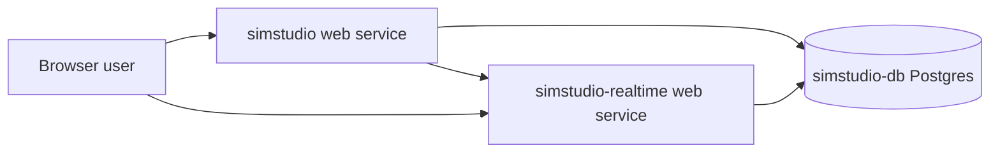

# Sim on Render

> Deploy Sim with its app, realtime socket server, and Postgres database on Render.

[](https://render.com/deploy-template/api/github/start?template_repo=sim-render-template)

This template deploys the open-source [Sim](https://github.com/simstudioai/sim) platform using the upstream container images and a Render-managed PostgreSQL database. It is for teams that want a self-hosted Sim workspace without running Docker Compose, managing Postgres, or copying service URLs between containers.


## Table of Contents

- [Why Deploy Sim on Render](#why-deploy-sim-on-render)
- [Use Cases](#use-cases)
- [What Gets Deployed](#what-gets-deployed)
- [Quickstart](#quickstart)
- [Configuration](#configuration)
- [Cost Breakdown](#cost-breakdown)
- [Customization](#customization)
- [Operations](#operations)
- [Upgrading](#upgrading)
- [Troubleshooting](#troubleshooting)
- [FAQ](#faq)
- [Security](#security)
- [Caveats and Limitations](#caveats-and-limitations)
- [Credits and License](#credits-and-license)

## Why Deploy Sim on Render

- **Managed Postgres**: Render provisions the database and wires `DATABASE_URL`.
- **Upstream images**: The template follows Sim's Docker-based production path.
- **Separate realtime service**: Socket.IO runs as its own web service with health checks.
- **Migration hook**: Database migrations run before the app starts each deploy.
- **Generated shared secrets**: Render creates the auth and internal API secrets.

## Use Cases

What you can build with this template:

- **Internal agent workflow builder**: Give a team a self-hosted canvas for AI automations.
- **RAG prototypes**: Upload documents and test knowledge-backed workflows.
- **Ops automation**: Connect tools, APIs, and models in a private workspace.
- **Self-hosted evaluation lab**: Test Sim before committing to a larger deployment.

## What Gets Deployed



| Resource | Type | Plan | Purpose |
|----------|------|------|---------|
| `simstudio` | Web service, Docker wrapper | `standard` | Runs the Sim Next.js app and migrations |
| `simstudio-realtime` | Web service, image | `starter` | Runs the Socket.IO realtime server |
| `simstudio-db` | PostgreSQL 17 | `basic-256mb` | Stores users, workspaces, workflows, and knowledge metadata |

Region: `oregon`. Change every `region` value in `render.yaml` before the first deploy if you need a different region. Database region is immutable after creation.

## Quickstart

1. Click **[Deploy to Render](https://render.com/deploy-template/api/github/start?template_repo=sim-render-template)**.
2. Choose the GitHub account or organization that should receive the fork.
3. In the Blueprint Apply form, set `ENCRYPTION_KEY` and `API_ENCRYPTION_KEY` to 64-character hex strings from `openssl rand -hex 32`.
4. Optionally set `COPILOT_API_KEY` if you already created one at [sim.ai](https://sim.ai).
5. Apply the Blueprint and wait for the first image pull, database migration, and service deploys. The first deploy usually takes 5 to 10 minutes.
6. Open the `simstudio` `*.onrender.com` URL when the service is live.

## Configuration

### Required Secrets

You set these in the Render Dashboard during the Blueprint Apply step.

| Env var | What it's for | How to get it |
|---------|---------------|---------------|
| `ENCRYPTION_KEY` | Encrypts stored workflow credentials and other sensitive values | Run `openssl rand -hex 32` |
| `API_ENCRYPTION_KEY` | Encrypts API keys stored by Sim | Run `openssl rand -hex 32` |

Both values must be 64-character hex strings. Do not use Render's generated secret format for these keys because Sim expects hex.

### Auto-Generated Secrets

Render generates these on first deploy and stores them as service env vars. Do not rotate them later unless you understand the data they protect.

| Env var | Purpose |
|---------|---------|
| `BETTER_AUTH_SECRET` | Signs Better Auth sessions and tokens |
| `INTERNAL_API_SECRET` | Authenticates internal calls between the app and realtime service |

### Wired Automatically

The Blueprint wires these values from other Render resources. You do not type them.

| Env var | Source |
|---------|--------|
| `DATABASE_URL` | `simstudio-db.connectionString` |
| `NEXT_PUBLIC_APP_URL` | `simstudio.RENDER_EXTERNAL_URL` |
| `BETTER_AUTH_URL` | `simstudio.RENDER_EXTERNAL_URL` |
| `NEXT_PUBLIC_SOCKET_URL` | `simstudio-realtime.RENDER_EXTERNAL_URL` |
| `SOCKET_SERVER_URL` | `simstudio-realtime.RENDER_EXTERNAL_URL` |
| `ALLOWED_ORIGINS` | `simstudio.RENDER_EXTERNAL_URL` |

### Optional Tweaks

Common things people change after deploying:

| Env var | Default | What it does |
|---------|---------|--------------|
| `COPILOT_API_KEY` | Empty | Enables Sim-managed Copilot features for self-hosted installs |
| `ADMISSION_GATE_MAX_INFLIGHT` | `500` | Caps concurrent workflow admissions in the app |
| `DISABLE_AUTH` | Empty | Bypasses authentication for private, trusted deployments |
| `TRUSTED_ORIGINS` | Empty | Adds extra auth origins, such as custom domain aliases |
| `OLLAMA_URL` | Empty | Points Sim at an Ollama server for local models |
| `REDIS_URL` | Empty | Enables Redis-backed realtime state for multi-instance scaling |

Full upstream configuration reference: [Sim self-hosting docs](https://docs.sim.ai/self-hosting/docker).

## Cost Breakdown

| Resource | Plan | Monthly cost |
|----------|------|--------------|
| `simstudio` | `standard` | $25 |
| `simstudio-realtime` | `starter` | $7 |
| `simstudio-db` | `basic-256mb` | $6 |
| **Total** | | **$38** |

Render's full pricing: [render.com/pricing](https://render.com/pricing).

**Cheaper:** You can try `starter` for `simstudio`, but expect memory pressure on larger workflows. Do not use the free plan for this template.

**Scale up:** Increase the `simstudio` plan first. Add Redis only when you scale realtime beyond one instance.

## Customization

### Pin the Upstream Version

The template defaults to the upstream `latest` image tags. Pin tags before production use:

```yaml
# render.yaml
image:
  url: ghcr.io/simstudioai/realtime:v0.6.92
```

For the app wrapper, pin both base images in `Dockerfile`:

```dockerfile
FROM ghcr.io/simstudioai/migrations:v0.6.92 AS migrations
FROM ghcr.io/simstudioai/simstudio:v0.6.92
```

### Add a Custom Domain

In the Render Dashboard, open `simstudio` → **Settings** → **Custom Domains** → **Add**. Render issues TLS automatically. After the domain is active, update `NEXT_PUBLIC_APP_URL`, `BETTER_AUTH_URL`, `ALLOWED_ORIGINS`, and any OAuth callback URLs to use the custom domain.

### Add Redis for Realtime Scaling

The default realtime service uses in-memory room state and should stay at one instance. To scale it horizontally, add a Render Key Value service and wire `REDIS_URL` into `simstudio-realtime`.

```yaml
- type: keyvalue
  name: simstudio-redis
  plan: starter
  region: oregon
  maxmemoryPolicy: noeviction
```

### Enable Third-Party OAuth

Add provider credentials as service env vars on `simstudio`, such as `GITHUB_CLIENT_ID`, `GITHUB_CLIENT_SECRET`, `GOOGLE_CLIENT_ID`, and `GOOGLE_CLIENT_SECRET`. Update provider callback URLs to match your Render or custom domain.

### Enable PR Previews

This template sets `previews.generation: off` because gallery deployments are one-shot forks. If you maintain your fork as an app repo, change it to `manual` or `automatic` after you understand the extra database cost.

## Operations

### Backups

Render backs up the managed PostgreSQL database according to the database plan. The template does not create a disk, so all persistent application data should live in Postgres or external providers configured by Sim.

### Monitoring

Use the Render Dashboard metrics and logs for both web services. The app health check is `/api/health`; the realtime health check is `/health`.

### Scaling

Scale `simstudio` vertically first. Keep `simstudio-realtime` at one instance unless you add Redis, because it stores room state in memory by default.

### Logs

In the Render Dashboard, open a service and choose **Logs**. CLI: `render logs --resources srv-your-service-id --tail`.

## Upgrading

### Pick Up Upstream Releases

Watch [Sim releases](https://github.com/simstudioai/sim/releases). If you use `latest`, trigger a manual deploy to pull the newest upstream images. If you pin tags, update `Dockerfile` and `render.yaml` together, then deploy.

### Breaking-Change Migrations

Read the upstream release notes before upgrading across major versions. The app service runs `bun run db:migrate` before each deploy, but application-level migration notes still matter for auth, integrations, and feature flags.

## Troubleshooting

### Deploy Fails During Image Pull

The GHCR image tag might be unavailable, mistyped, or temporarily unreachable. Confirm the tag exists in [the upstream packages](https://github.com/simstudioai/sim/pkgs/container/simstudio), then redeploy.

### Service Starts but Health Check Fails

Check the service logs first. Common causes are a missing 64-character `ENCRYPTION_KEY`, a failed database migration, or an app plan that is too small for startup memory.

### `ENCRYPTION_KEY must be set to a 64-character hex string`

Replace `ENCRYPTION_KEY` with the output of `openssl rand -hex 32`, then redeploy. Do not rotate this value after users store credentials unless you are prepared to re-encrypt existing data.

### Browser Cannot Connect to Realtime

Check that `NEXT_PUBLIC_SOCKET_URL` on `simstudio` points to the `simstudio-realtime` external URL and that `ALLOWED_ORIGINS` on `simstudio-realtime` points to the app external URL or custom domain.

### Workflows Work Locally but Fail on Render

Check whether the workflow depends on a provider API key or a local-only endpoint such as Ollama. Add provider keys as env vars or point `OLLAMA_URL` at a reachable service.

### Anything Else

- Service logs: Dashboard → service → **Logs**
- Deploy logs: Dashboard → service → **Events** → failed deploy
- Template bugs: open an issue in this template repo
- Application bugs: open an issue in [simstudioai/sim](https://github.com/simstudioai/sim/issues)

## FAQ

### Can I Run This on Render's Free Plan?

No. Sim is a multi-service app with Postgres and a large Node runtime. Use the default paid plans first, then downsize only after observing memory and CPU metrics.

### Why Is There a Dockerfile if the Template Uses Upstream Images?

Render's `preDeployCommand` runs inside the app service image. The upstream app image does not include the migration workspace, so this template builds a small wrapper that copies migration files from `ghcr.io/simstudioai/migrations`.

### Do I Need a Copilot API Key?

Only if you want Sim-managed Copilot on a self-hosted instance. You can deploy without it and add `COPILOT_API_KEY` later.

### Can I Use a Custom Domain?

Yes. Add the custom domain to `simstudio`, then update the public app URL and auth URL env vars to match it. Also update OAuth provider callback URLs.

### Can I Migrate Existing Sim Data?

Yes, if you can export from your current PostgreSQL database and restore into `simstudio-db`. Stop writes during the migration, restore the dump, then redeploy both services.

### What Happens if I Delete the Database?

You lose Sim data after the database and its retained backups are gone. Export first if you need to keep workflows, users, and workspace data.

## Security

- **Encryption at rest:** Render-managed PostgreSQL is encrypted at rest. Sim also encrypts stored secrets with `ENCRYPTION_KEY` and API keys with `API_ENCRYPTION_KEY`.
- **Encryption in transit:** Render terminates TLS for `*.onrender.com` and custom domains. App-to-database traffic uses Render's private network connection string.
- **Network exposure:** Both web services are public because browsers connect to the app and Socket.IO endpoint. Internal POST routes require `INTERNAL_API_SECRET`.
- **Secret rotation:** Rotate `COPILOT_API_KEY` when needed. Do not rotate `ENCRYPTION_KEY`, `API_ENCRYPTION_KEY`, `BETTER_AUTH_SECRET`, or `INTERNAL_API_SECRET` without planning for sessions and encrypted data.
- **Reporting vulnerabilities:** Template issues belong in this repo. Application vulnerabilities belong in the upstream [Sim security policy](https://github.com/simstudioai/sim/security).

## Caveats and Limitations

- The default realtime service is single-instance. Add Redis before scaling it horizontally.
- The template uses upstream `latest` tags by default. Pin tags for production change control.
- The app plan starts at `standard`. Downgrading can produce startup OOMs or health check failures.
- `ENCRYPTION_KEY` and `API_ENCRYPTION_KEY` are manual because Sim requires 64-character hex strings.
- The first deploy pulls large images and runs migrations, so it is slower than later deploys.
- Postgres region and major version are immutable after creation.

## Credits and License

- **Upstream:** [simstudioai/sim](https://github.com/simstudioai/sim) under the Apache License 2.0
- **Render template:** MIT, see [LICENSE](./LICENSE)
- **Template maintainer:** [render-examples](https://github.com/render-examples)

If this template helps you, give the upstream Sim repo a star.
